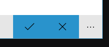
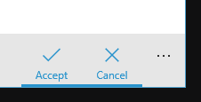

# App Bar Toggle Button Underline Style
A custom App Bar Toggle Button Style for UWP which looks similar to Windows in-built apps

## Style differences for AppBarToggleButton
### Unchecked

### Checked - Default style

### Checked - Style used in In-Built apps

## Usage
This style works only for AppBarToggleButton for UWP in **Windows 10 Anniversary Update (14393)** and above. For previous Windows builds, the Visual States like `LabelOnRight`, `LabelCollapsed` etc., should be deleted/updated.