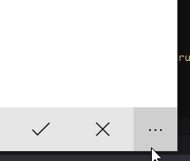

# Icon In Secondary App Bar Button Style
A simple style that allows you to show Icon in App Bar Button when placed in Secondary Commands of Command Bar.

## 	Preview

## Usage
1. Use `IconInSecondaryAppBarButtonStyle` for AppBarButton
2. Use `IconInSecondaryAppBarToggleButtonStyle` for AppBarToggleButton

Checked with **Windows 10 Anniversary Update (14393)**.