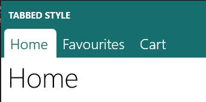

# Pivot Tabbed Style
A style for Pivot control to look like a Tab control, similar to the ones in OneNote.

## Preview

## Usage
* This style actually consists of 2 separate Styles: one for the `Pivot` control and one for `PivotHeaderItem` control. Both of the styles should be applied to get the correct result
* Set the `Margin` of `PivotItem` to `0`
* Set the `Background` of `PivotItem` to `White`

The `Background` defaults to `SystemControlBackgroundAccentBrush`. But it can be changed.

Checked with **Windows 10 Creators Update 15063**